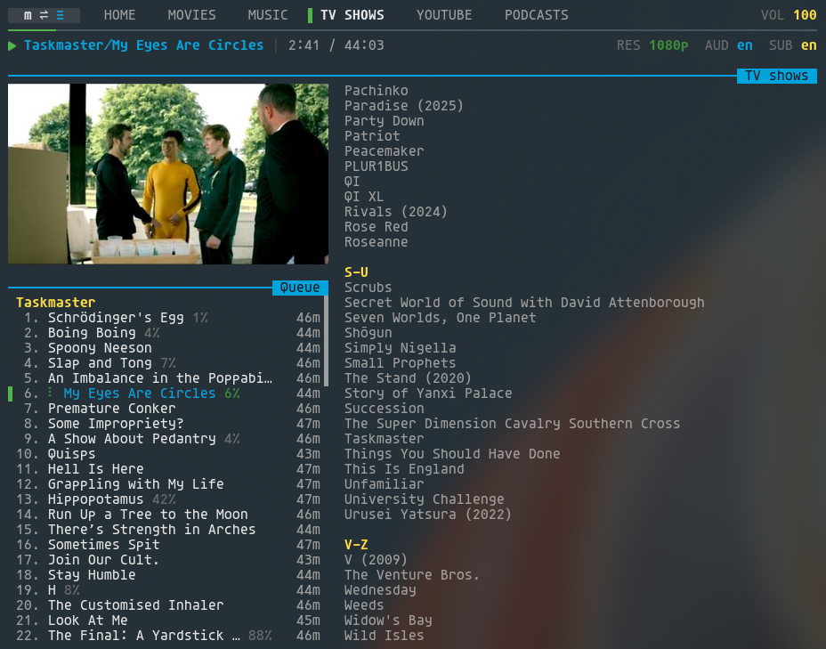
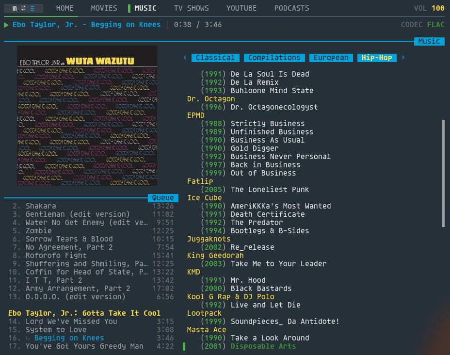

# mbv

A terminal UI client for [Emby](https://emby.media) media servers that uses mpv (and controls/communicates it with via libmpv) as its media player.

This was made because I use Niri and the beta client does not officially support that. The old official Linux client is increasingly problematic. The browser is a bit slow and problematic as well for me, and I find launching things directly in mpv to be much snappier and able to play more without error. In addition, I'm super old and my eyes are inconsistent, and so I often just watch videos on my monitor while I work because the TV is so far away and require a completely different set of glasses (old). This workflow works really well for me. I'm not crazy.

This allows one to browse libraries, build a queue, and play media from their library in a way that syncs playback with the Emby server. A person can leverage the standard Emby remote control API to control playback from any Emby remote app on their phone or browser. It can also run headless as a background daemon to provide a purely remote-controlled mpv launcher lol.

This was built with AI because I am lazy and I already have a job (for now). You can tell because there's a lot of unnecessary images in a TUI app.

 

## Requirements

- Rust toolchain (for building)
- [mpv](https://mpv.io) libraries (`libmpv`)
- `notify-send` (from `libnotify`) — only needed if `system_notifications = true`

## Installation

```sh
make install
```
Or if you are on Arch just use AUR.

```sh
paru -Syu mbv
```

Installs the binary to `~/.local/bin/mbv`.

## Usage

```sh
mbv          # launch with terminal UI
mbv --daemon # run headless, controlled via remote only
```

## Configuration

On first run a login screen prompts for server URL, username, and password. Credentials are saved after a successful login. You don't need to touch a config file to use mbv — nearly every setting is editable live from the in-app Settings panel (`F2`).

Press `F1` at any time to open the help and keybindings reference.

### In-app settings (`F2`)

- **Daemon mode on exit** — keep mbv running as a background daemon when you close the TUI window.
- **Start on queue** — start on the Queue tab instead of Home on launch.
- **Always play next** — always play the next queue item automatically, even for videos.
- **Consume videos** / **Consume audio** — remove an item from the queue and mpv's playlist once it finishes playing.
- **Save playlist on consume** / **Save playlist on consume (audio)** — push the queue back to its saved Emby playlist immediately after each consume.
- **Always skip intro** — skip intros automatically without prompting.
- **Image protocol** — album art and card image rendering: halfblocks, sixel, kitty, iterm2, or auto.
- **Hidden libraries** — hide libraries from the tab bar (case-insensitive).
- **Hidden latest** — hide the Latest block for specific libraries on the Home tab (case-insensitive); doesn't affect the library tab itself.
- **Show audio window** — show an mpv window for audio playback instead of running headless.
- **Use mpv config** — use your own `~/.config/mpv/` setup (scripts, OSC, mpv.conf) instead of mbv's bundled OSC.
- **No scripts** / **autoload** — disable mpv's default scripts / enable mpv's autoload script for adjacent files.
- **Show systray icon** — show a system tray icon when running in daemon mode.
- **System notifications** — send desktop notifications (via `notify-send`) for toasts and interactive prompts (Skip Intro, Next Up, queue prompts) instead of in-TUI toasts; prompts include action buttons.
- **My languages**, **Subtitle mode**, **Subtitle language**, **Audio language** — client-only playback language preferences.
- **Feed view** — libraries to treat as feed views (unplayed/date-sorted defaults).
- **Log out**.

### File-only options (`~/.config/mbv/config.toml`)

A handful of knobs have no live UI and only take effect via a hand-edited config file:

```toml
[server]
# Override the server URL. Rarely needed — the login screen sets and persists
# this after your first successful login.
url = "http://emby.local:8096"

[mpv]
# PCM pipe output for external consumers like Snapserver. No live toggle.
audio_pipe_enabled = false
audio_pipe_path = "/tmp/mbv-pipe"
# Snapserver's `sampleformat` must match these two exactly.
audio_pipe_samplerate = 192000
audio_pipe_bitdepth = 32

[music]
# Describe the folder layout of your music library so mbv can identify albums.
# Each entry names one level of nesting; the track/file level is always implied
# and should not be included. See "Special music library handling" under Features.
levels = ["group", "album"]
```

## Features

### Emby-Parity Features

- **Library browsing and search** — navigate folders and series, jump to seasons and episodes, and fuzzy-search within libraries.
- **Resume and watched-state sync** — videos resume from saved position and watched status is reported back to Emby.
- **Standard remote control compatibility** — any normal Emby remote app on your phone or browser can control mbv in real time.
- **Session control from mbv** — connect to another active Emby session and drive it from mbv's controls and keyboard. `F3` opens the session list.
- **Playlist integration** — browse Emby playlists, enqueue them, and save the current queue back to Emby with `Ctrl+S`.
- **Normal playback controls** — seek, pause, adjust volume, cycle audio tracks, and enable subtitles from the keyboard.
- **Home / continue-watching views** — see Continue Watching items and recent additions across libraries.

### mbv-Only Features

- **Dedicated persistent queue** — mbv keeps its own queue model instead of relying on Emby's simpler play-next/play-later behavior. It supports queue-source tracking, undo delete, direct jump-to-library from queue items, and queue-first workflows.
- **mbv-to-mbv remote control** — mbv can connect directly to another mbv daemon over its own control protocol rather than only through standard Emby session control.
- **Headless daemon mode** — run mbv as a background playback service with no terminal required, then drive it remotely.
- **mpv-first playback model** — playback runs through embedded mpv, including headless audio playback and optional PCM pipe output.
  Configure PCM pipe compatibility with `[mpv].audio_pipe_samplerate` and `[mpv].audio_pipe_bitdepth` (`16`, `24`, or `32`). Snapserver's `sampleformat` must match both values exactly. The pipe itself is config-only; there is no live UI toggle.
- **Opinionated playback defaults** — mbv prefers English audio, starts with subtitles off, and hides image-based subtitle tracks that do not work in headless mpv playback.
- **Special music library handling** — mbv can understand folder-shaped music libraries via `[music].levels`, including grouped music browsing that standard Emby clients do not provide.
- **Feed-library defaults** — selected libraries can behave like feed views with unplayed/date-sorted defaults, which is useful for YouTube/channel-style libraries.
- **Extra local control surfaces** — MPRIS integration lets desktop widgets, `playerctl`, and media keys control mbv directly.
- **Desktop-integrated prompts** — with `system_notifications = true`, Skip Intro, Next Up, and queue prompts can be surfaced as actionable desktop notifications.
